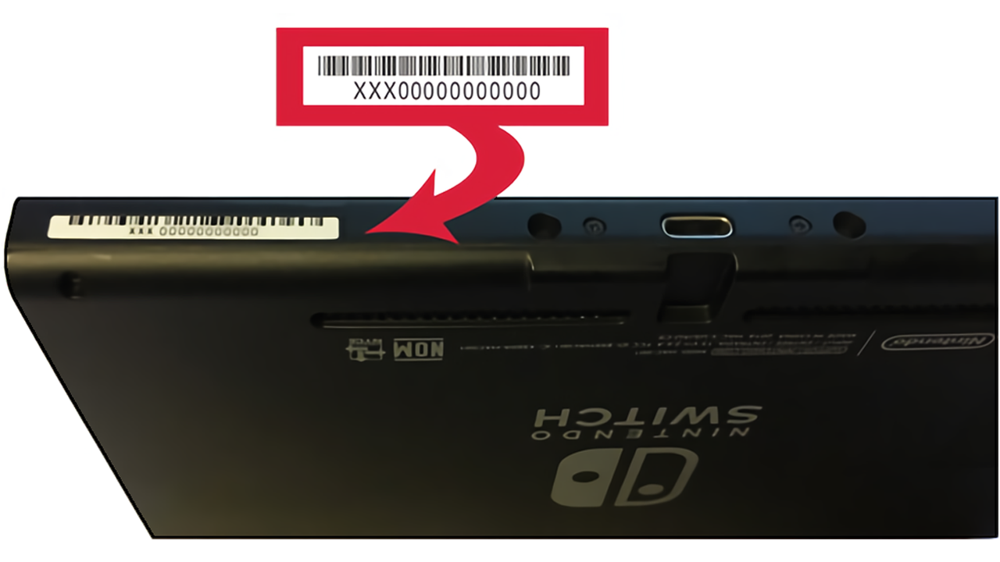
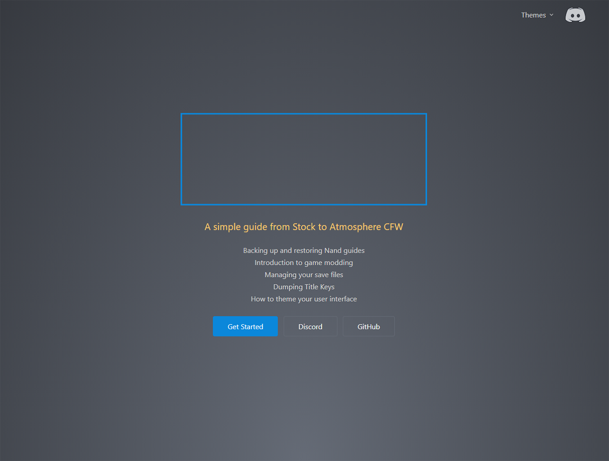
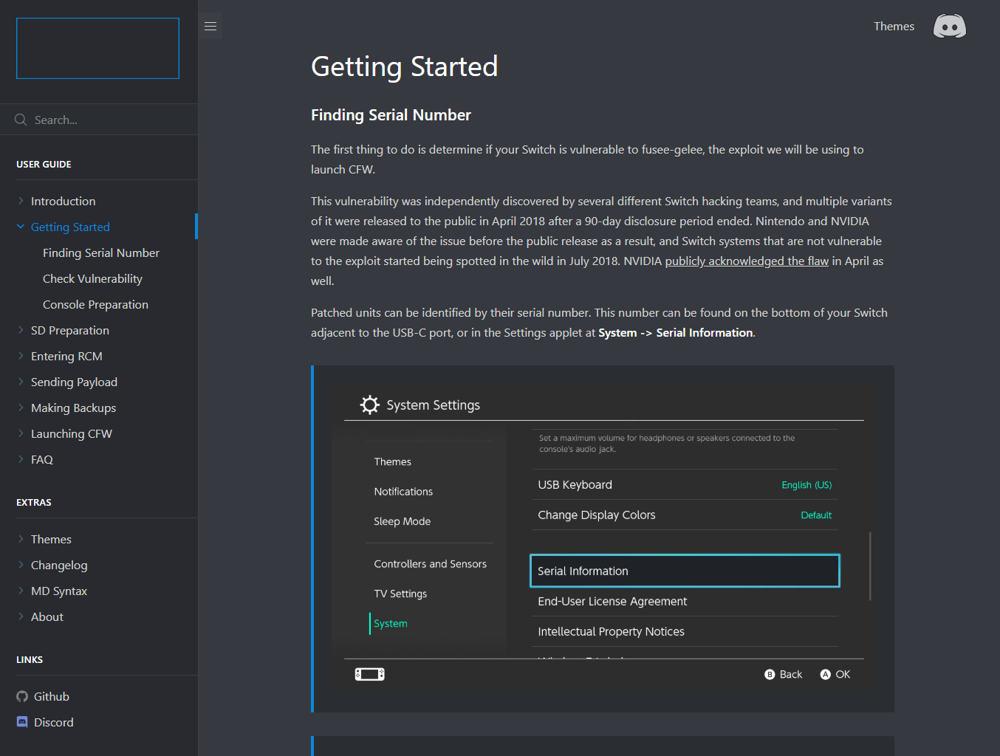
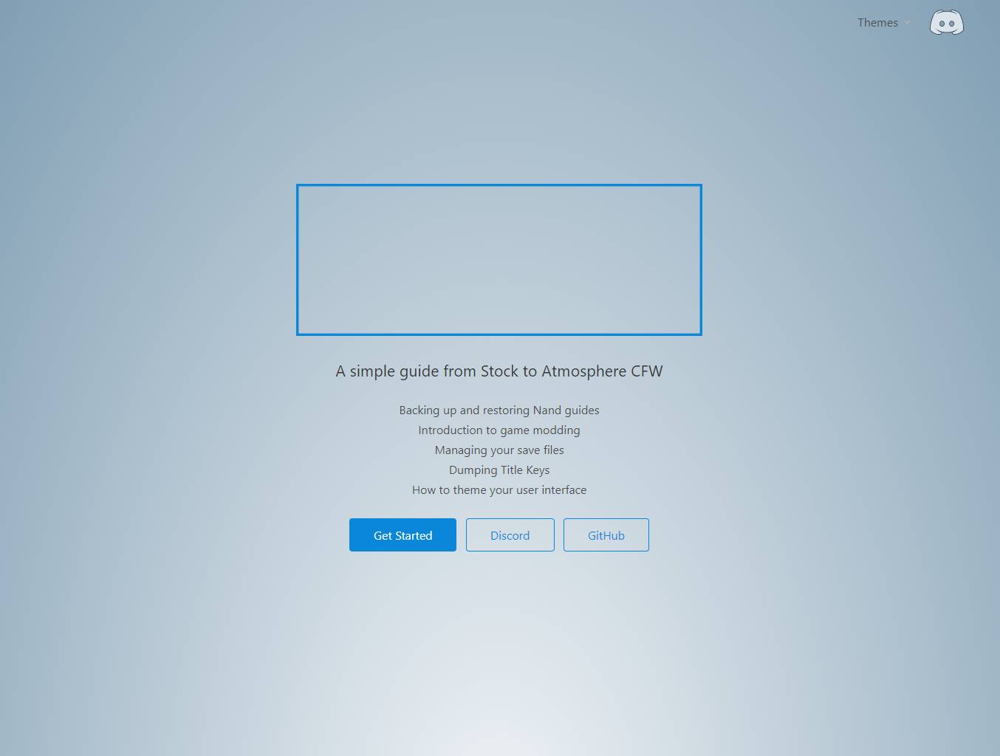
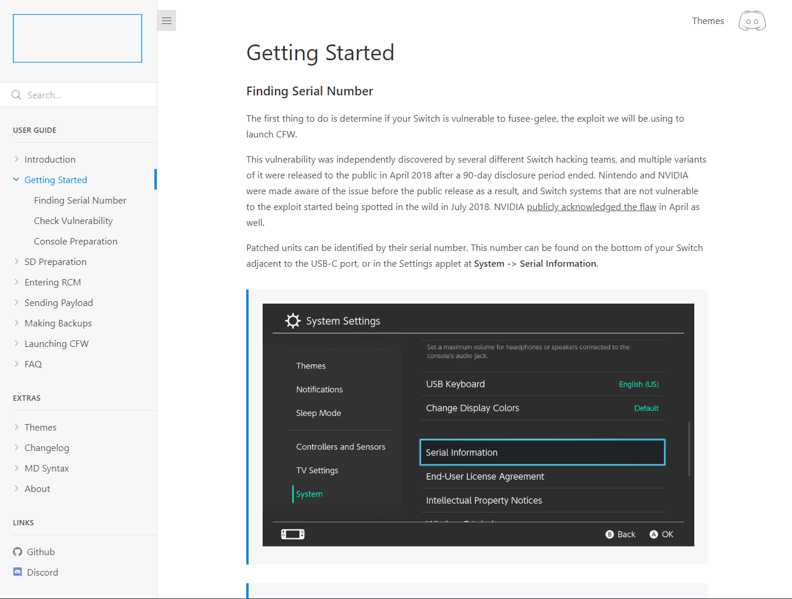

# Markdown Syntax

## Headings

<!-- tabs:start -->

#### ** Rendered **

# Heading 1 {docsify-ignore}

Lorem ipsum dolor sit amet, consectetur adipiscing elit.

## Heading 2 {docsify-ignore}

Vestibulum lobortis laoreet nunc vel vulputate.

### Heading 3 {docsify-ignore}

Suspendisse sit amet tincidunt nibh, ac interdum velit.

#### Heading 4 {docsify-ignore}

Donec odio orci, facilisis ac vehicula in, vestibulum ut urna.

##### Heading 5 {docsify-ignore}

Commodo sit veniam nulla cillum labore ullamco aliquip quis.

###### Heading 6 {docsify-ignore}

Ipsum ea amet dolore mollit incididunt fugiat nulla laboris est sint voluptate.

#### ** Markdown **

```markdown
# Heading 1

Lorem ipsum dolor sit amet, consectetur adipiscing elit.

## Heading 2

Vestibulum lobortis laoreet nunc vel vulputate.

### Heading 3

Suspendisse sit amet tincidunt nibh, ac interdum velit.

#### Heading 4

Donec odio orci, facilisis ac vehicula in, vestibulum ut urna.

##### Heading 5

Commodo sit veniam nulla cillum labore ullamco aliquip quis.

###### Heading 6

Ipsum ea amet dolore mollit incididunt fugiat nulla laboris est sint voluptate.
```

<!-- tabs:end -->

## Text

<!-- tabs:start -->

#### ** Rendered **

Body text

**Bold text**

*Italic text*

~~Strikethrough~~

<mark>Marked text</mark>

<pre>Preformatted text</pre>

<small>Small Text</small>

This is <sub>subscript</sub>

This is <sup>superscript</sup>

#### ** Markdown **

```markdown
Body text

**Bold text**

*Italic text*

~~Strikethrough~~

<mark>Marked text</mark>

<pre>Preformatted text</pre>

<small>Small Text</small>

This is <sub>subscript</sub>

This is <sup>superscript</sup>
```

<!-- tabs:end -->

## Links

<!-- tabs:start -->

#### ** Rendered **

[Inline link](https://google.com)

[Inline link with title](https://google.com "Google")

[Reference link by name][link1]

[Reference link by number][1]

[Reference link by self]

[link1]: https://google.com
[1]: https://google.com
[Reference link by self]: https://google.com

#### ** Markdown **

```markdown
[Inline link](https://google.com)

[Inline link with title](https://google.com "Google")

[Reference link by name][link1]

[Reference link by number][1]

[Reference link by self]

[link1]: https://google.com
[1]: https://google.com
[Reference link by self]: https://google.com
```

<!-- tabs:end -->

## Lists

<!-- tabs:start -->

#### ** Rendered **

**Ordered Lists**

1. Ordered 1
1. Ordered 2
   1. Ordered 2a
   1. Ordered 2b
   1. Ordered 2c
1. Ordered 3

**Unordered Lists**

- Unordered 1
- Unordered 2
  - Unordered 2a
  - Unordered 2b
  - Unordered 2c
- Unordered 3

**Task Lists**

- [x] Task 1
- [ ] Task 2
  - [x] Subtask A
  - [ ] Subtask B
- [ ] Task 3

#### ** Markdown **

```markdown
**Ordered Lists**

1. Ordered 1
1. Ordered 2
   1. Ordered 2a
   1. Ordered 2b
   1. Ordered 2c
1. Ordered 3

**Unordered Lists**

- Unordered 1
- Unordered 2
  - Unordered 2a
  - Unordered 2b
  - Unordered 2c
- Unordered 3

**Task Lists**

- [x] Task 1
- [ ] Task 2
  - [x] Subtask A
  - [ ] Subtask B
- [ ] Task 3
```

<!-- tabs:end -->

## Blockquotes

<!-- tabs:start -->

#### ** Rendered **

> Cras aliquet nulla quis metus tincidunt, sed placerat enim cursus. Etiam
> turpis nisl, posuere eu condimentum ut, interdum a risus. Sed non luctus mi.
> Quisque malesuada risus sit amet tortor aliquet, a posuere ex iaculis. Vivamus
> ultrices enim dui, eleifend porttitor elit aliquet sed.
>
> *- Quote Source*

#### ** Markdown **

```markdown
> Cras aliquet nulla quis metus tincidunt, sed placerat enim cursus. Etiam
> turpis nisl, posuere eu condimentum ut, interdum a risus. Sed non luctus mi.
> Quisque malesuada risus sit amet tortor aliquet, a posuere ex iaculis. Vivamus
> ultrices enim dui, eleifend porttitor elit aliquet sed.
>
> *- Quote Source*
```

<!-- tabs:end -->

## Notices

<!-- tabs:start -->

#### ** Rendered **

!> **Important** notice with `inline code` and additional placeholder text used
to force the content to wrap and span multiple lines.

?> **Tip** notice with `inline code` and additional placeholder text used to
force the content to wrap and span multiple lines.

#### ** Markdown **

```markdown
!> **Important** notice with `inline code` and additional placeholder text used
to force the content to wrap and span multiple lines.

?> **Tip** notice with `inline code` and additional placeholder text used to
force the content to wrap and span multiple lines.
```

<!-- tabs:end -->

## Tabs

<!-- tabs:start -->

#### **English**

Hello!

#### **French**

Bonjour!

#### **Italian**

Ciao!

#### ** Markdown **

```markdown
<!-- tabs:start -->

#### **English**

Hello!

#### **French**

Bonjour!

#### **Italian**

Ciao!

<!-- tabs:end -->
```

<!-- tabs:end -->

## Horizontal Rule

<!-- tabs:start -->

#### ** Rendered **

---

#### ** Markdown **

```markdown
---
```

<!-- tabs:end -->

## Images

<!-- tabs:start -->

#### ** Rendered **


> 

#### ** Markdown **

```markdown


> 
```

<!-- tabs:end -->

## Thumbnails

<!-- tabs:start -->

#### ** Rendered **

**Thumbnails (4)**

<figure class="thumbnails">
    
    
    
    
</figure>

**Thumbnails (2)**

<figure class="thumbnails">
     
    
</figure>

**Default image with shadows from thumbnail css**

<figure class="thumbnails">
     
</figure>

#### ** Markdown **

```markdown
**Thumbnails (4)**

<figure class="thumbnails">
    
    
    
    
</figure>

**Thumbnails (2)**

<figure class="thumbnails">
     
    
</figure>

**Default image with shadows from thumbnail css**

<figure class="thumbnails">
     
</figure>
```

<!-- tabs:end -->

## Code Window

<!-- tabs:start -->

#### ** Rendered **

Windows Joiner Script

```cmd
copy /b rawnand.bin.* rawnand.bin
```

Linux/Mac Joiner Script

```terminal
#!/usr/bin/env bash
if command -v pv >/dev/null; then
	cat rawnand.bin.* | pv -s 30g > rawnand.bin
else
	cat rawnand.bin.* > rawnand.bin
fi
```

#### ** Markdown **

````markdown
Windows Joiner Script

```cmd
copy /b rawnand.bin.* rawnand.bin
```

Linux/Mac Joiner Script

```terminal
#!/usr/bin/env bash
if command -v pv >/dev/null; then
	cat rawnand.bin.* | pv -s 30g > rawnand.bin
else
	cat rawnand.bin.* > rawnand.bin
fi
```
````

<!-- tabs:end -->

## Tables

<!-- tabs:start -->

#### ** Rendered **

| Left Align | Center Align | Right Align | Non&#8209;Breaking&nbsp;Header |
| ---------- |:------------:| -----------:| ------------------------------ |
| A1         | A2           | A3          | A4                             |
| B1         | B2           | B3          | B4                             |
| C1         | C2           | C3          | C4                             |

#### ** Markdown **

```markdown
| Left Align | Center Align | Right Align | Non&#8209;Breaking&nbsp;Header |
| ---------- |:------------:| -----------:| ------------------------------ |
| A1         | A2           | A3          | A4                             |
| B1         | B2           | B3          | B4                             |
| C1         | C2           | C3          | C4                             |
```

<!-- tabs:end -->

## Keyboard

<!-- tabs:start -->

#### ** Rendered **

<kbd>&uarr;</kbd> Arrow Up

<kbd>&darr;</kbd> Arrow Down

<kbd>&larr;</kbd> Arrow Left

<kbd>&rarr;</kbd> Arrow Right

<kbd>&#8682;</kbd> Caps Lock

<kbd>&#8984;</kbd> Command

<kbd>&#8963;</kbd> Control

<kbd>&#9003;</kbd> Delete

<kbd>&#8998;</kbd> Delete (Forward)

<kbd>&#8600;</kbd> End

<kbd>&#8996;</kbd> Enter

<kbd>&#9099;</kbd> Escape

<kbd>&#8598;</kbd> Home

<kbd>&#8670;</kbd> Page Up

<kbd>&#8671;</kbd> Page Down

<kbd>&#8997;</kbd> Option, Alt

<kbd>&#8629;</kbd> Return

<kbd>&#8679;</kbd> Shift

<kbd>&#9251;</kbd> Space

<kbd>&#8677;</kbd> Tab

<kbd>&#8676;</kbd> Tab + Shift

#### ** Markdown **

```markdown
<kbd>&uarr;</kbd> Arrow Up

<kbd>&darr;</kbd> Arrow Down

<kbd>&larr;</kbd> Arrow Left

<kbd>&rarr;</kbd> Arrow Right

<kbd>&#8682;</kbd> Caps Lock

<kbd>&#8984;</kbd> Command

<kbd>&#8963;</kbd> Control

<kbd>&#9003;</kbd> Delete

<kbd>&#8998;</kbd> Delete (Forward)

<kbd>&#8600;</kbd> End

<kbd>&#8996;</kbd> Enter

<kbd>&#9099;</kbd> Escape

<kbd>&#8598;</kbd> Home

<kbd>&#8670;</kbd> Page Up

<kbd>&#8671;</kbd> Page Down

<kbd>&#8997;</kbd> Option, Alt

<kbd>&#8629;</kbd> Return

<kbd>&#8679;</kbd> Shift

<kbd>&#9251;</kbd> Space

<kbd>&#8677;</kbd> Tab

<kbd>&#8676;</kbd> Tab + Shift
```

<!-- tabs:end -->